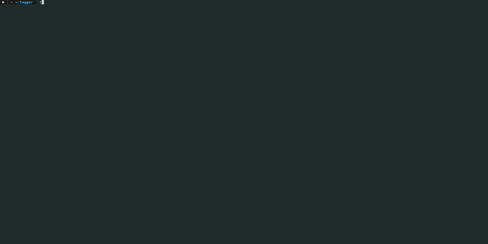

# Taggercli
## Demo
### CLI

### Report
[Report Demo](https://do9f59b42yfy1.cloudfront.net/#/)
## Installation

The taggercli can be installed via pip.  
Running  `pip install PLACEHOLDER PYPI NAME` will install the CLI

## Usage

The main commands are   
- `tagger report create`
- `tagger tag all`


### Report creation

The `report create` command first scans your AWS account (specified in your configuration, see *Configuration* for more information)
and compares the tags of found resources with tags specified in your configuration file. A html report is generated showing the results from the comparison.  
If no region is specified via `--region` the default from the configuration file is used.  

### Tag all
The `tag all` command first scans a given AWS region and your global resources.
It displays a list of all the found resources and applies tags found in the configuration file.  
If no region is specified via `--region` the default from the configuration file is used.

### Supported resources
Please see the taggercore [README](../taggercore/README.md) for a list of supported resources.
 

## Prerequisites
### Configuration
  
`tagger config create` creates a config file and writes the result to `~/.tagger/config.ini`  
The profile provided should be present in your AWS configuration file. Per default boto looks at `~/.aws/config` for the profile. Please make sure the specified profile has all the required permissions.  

The `config.ini` is also used to specify the given tag schema.  
The config file is **case-sensitive**!


### AWS Permissions
**AWS Managed policies**
- ReadOnlyAccess
- ResourceGroupsandTagEditorFullAccess  

**Custom policy**  
Even though ResourceGroupsandTagEditorFullAccess allows access to the Resource Groups Tagging API additional permissions for the individual resources are necessary to perform the tagging operation.
```
{
    "Version": "2012-10-17",
    "Statement": [
        {
            "Effect": "Allow",
            "Action": [
                "acm:AddTagsToCertificate",
                "apigateway:POST",
                "apigateway:PUT",
                "cloudfront:TagResource",
                "cloudtrail:AddTags",
                "cloudwatch:TagResource",
                "dynamodb:TagResource",
                "ec2:CreateTags",
                "elasticache:AddTagsToResource",
                "elasticbeanstalk:AddTags",
                "elasticloadbalancing:AddTags",
                "es:AddTags",
                "events:TagResource",
                "firehose:TagDeliveryStream",
                "iam:TagRole",
                "iam:TagUser",
                "kinesis:AddTagsToStream",
                "lambda:TagResource",
                "logs:TagLogGroup",
                "rds:AddTagsToResource",
                "route53:ChangeTagsForResource",
                "s3:PutBucketTagging",
                "sns:TagResource",
                "sqs:TagQueue"
            ],
            "Resource": [
                "*"
            ]
        }
    ]
}
```
## Development
Install dev dependencies:  
`pipenv install -e .[dev]`  

Run tests:  
`tox`

Run black for code formatting:  
`tox -e format`
