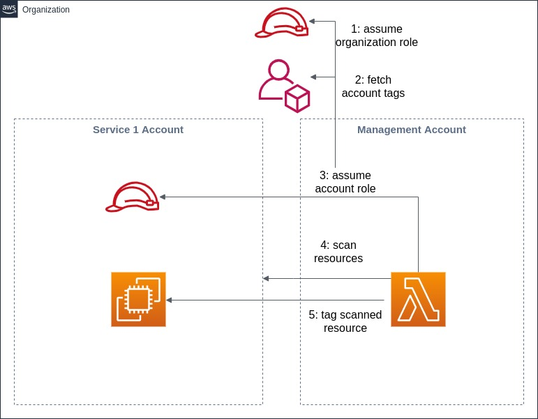
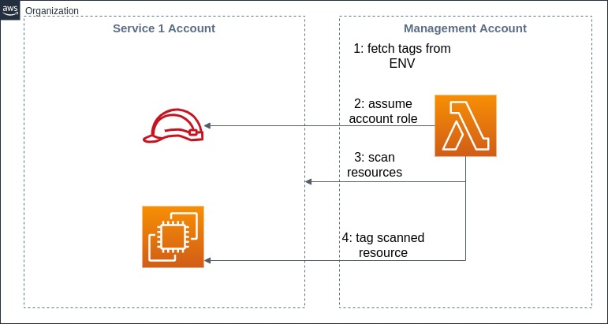
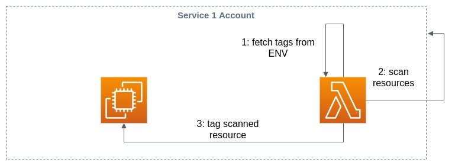

# Taggerlambda

## About
Taggerlambda helps you with managing your AWS tags. It can be scheduled to run periodically in your AWS account, search for resources and apply configured tags to those resources.   
All resources listed in the [taggercore README](../taggercore/README.md) are supported.
  
Please take a look at the scenarios section for the different deployment strategies.


## Prerequisites
SAM CLI installed ([installation guide](https://docs.aws.amazon.com/serverless-application-model/latest/developerguide/serverless-sam-cli-install.html))

SAM needs an S3 bucket, you can create one by running  
`aws s3 mb s3://{BUCKET_NAME} --region {REGION_NAME}`

## Usage

Taggerlambda uses [SAM](https://docs.aws.amazon.com/serverless-application-model/latest/developerguide/what-is-sam.html) for deployment.

To get started select a deployment scenario from below.   
Take a look at the configuration section of selected scenario and fill in the placeholders in the template.yml files.  
Afterwards you can start the sam build by running:
```bash
sam build -t template_account.yml
```
Please adapt the template file name according to your chosen scenario!

SAM uploads the build output to s3 by running:
```bash
sam package --s3-bucket {YOUR_BUCKET_NAME}
```
To finally deploy the lambda  run:
```bash
sam deploy --s3-bucket {YOUR_BUCKET_NAME} --stack-name {STACK_NAME} --region {YOUR_REGION} --capabilities CAPABILITY_IAM
```

The bucket name in the package-command must match the bucket name in the deploy-command.  
Feel free to choose a name for the deployed stack by setting `--stack-name`

## General configuration
**`TAG_GLOBAL_RES`**   
indicates whether global resources (e.g. IAM, Cloudfront) should be tagged 
```yaml
Environment:
    Variables:
      TAG_GLOBAL_RES: 'TRUE'
```
**Schedule**
```yaml
Events:
    SchedulingEvent:
      Type: Schedule
      Properties:
        Schedule: rate(1 day)
```
The standard templates use a CloudWatch Event to trigger the Lambda function. 
Please see the [AWS documentation](https://docs.aws.amazon.com/eventbridge/latest/userguide/scheduled-events.html) for all the supported scheduling expressions! 
## Scenarios
### Cross account deployment with account tags


The lambda function will be deployed in a management account.  
It fetches tags attached to the Service 1 account, scans the Service 1 account and applies the tags to the scanning result.  
Every tag applied to the Service 1 account will be attached to the scanned resources.
#### Configuration  
Please specify the following ENV variables in  [template_cross_account.yml](template_cross_account.yml)
```yaml
Environment:
    Variables:
      TAG_MODE: 'ACCOUNT'
      TAGS: '{YOUR_TAGS}' # e.g. Project=Marketing, Owner=Team1
      ACCOUNT_ID: '{SERVICE_1_ACCOUNT_ID}'
      ORGA_ROLE: 'ORGA_ROLE_ARN'
      ACCOUNT_ROLE: '{ACCOUNT_ROLE_ARN}'
      REGION: '{REGION_NAME}' #e.g. eu-central-1
```
**`ORGA_ROLE`** 

This role needs access to the Organization API.  
Currently, this is only possible by using a role in the **master** account of the organization.
The role should have the policy: 
`AWSOrganizationsReadOnlyAccess` and a **trust relationship** with the **management** account:
```
{
     "Version": "2012-10-17",
     "Statement": [
       {
         "Effect": "Allow",
         "Principal": {
           "AWS": "arn:aws:iam::{MANAGEMENT_ACCOUNT_ID}:root"
         },
         "Action": "sts:AssumeRole",
         "Condition": {}
       }
     ]
}
```
Please replace `{MANAGEMENT_ACCOUNT_ID}` with the AWS account id of your management account.


**`ACCOUNT_ROLE`**

This role needs the following policies:  

AWS managed:  
- `ResourceGroupsandTagEditorFullAccess`
- `ReadOnlyAccess`

Custom:

```
{
    "Version": "2012-10-17",
    "Statement": [
        {
            "Sid": "AllowTaggingOperations",
            "Effect": "Allow",
            "Action": [
                "sns:TagResource",
                "lambda:TagResource",
                "iam:TagRole",
                "elasticbeanstalk:AddTags",
                "elasticbeanstalk:ListTagsForResource",
                "es:AddTags",
                "logs:TagLogGroup",
                "dynamodb:TagResource",
                "s3:PutBucketTagging",
                "cloudtrail:AddTags",
                "firehose:TagDeliveryStream",
                "rds:AddTagsToResource",
                "apigateway:PUT",
                "ec2:CreateTags",
                "cloudfront:TagResource",
                "acm:AddTagsToCertificate",
                "elasticache:AddTagsToResource",
                "iam:TagUser",
                "cloudwatch:TagResource",
                "events:TagResource",
                "sqs:TagQueue",
                "kinesis:AddTagsToStream",
                "elasticloadbalancing:AddTags",
                "route53:ChangeTagsForResource",
                "apigateway:POST"
            ],
            "Resource": "*"
        }
    ]
}
```

This role needs a trust relationship too: 
```
{
     "Version": "2012-10-17",
     "Statement": [
       {
         "Effect": "Allow",
         "Principal": {
           "AWS": "arn:aws:iam::{MANAGEMENT_ACCOUNT_ID}:root"
         },
         "Action": "sts:AssumeRole",
         "Condition": {}
       }
     ]
}
```
Please replace `{MANAGEMENT_ACCOUNT_ID}` with the AWS account id of your management account.


### Cross account deployment with env tags


The lambda function will be deployed in a management account. Tags from the ENV variable `TAGS` will be used.
Every tag found in the ENV variable will be attached to the scanned resources (located account Service 1).

#### Configuration  
Please specify the following ENV variables in  [template_cross_account.yml](template_cross_account.yml)

```yaml
Environment:
    Variables:
      TAG_MODE: 'ENV'
      TAGS: '{YOUR_TAGS}' # e.g. Project=Marketing, Owner=Team1
      ACCOUNT_ID: '{SERVICE_1_ACCOUNT_ID}'
      ACCOUNT_ROLE: '{ACCOUNT_ROLE_ARN}'
      REGION: '{REGION_NAME}' #e.g. eu-central-1
```

**`ACCOUNT_ROLE`**

Please see use the configuration from [Scenario 1](#cross-account-deployment-with-account-tags)


### Account deployment with env tags



The lambda function will be deployed in the account it should scan and tag.  
Tags from the ENV variable `TAGS` will be used.  
Each tag found in the ENV variable will be attached to the scanned resources (located in account Service 1).

### Configuration
Please specify the following ENV variables in  [template_account.yml](template_account.yml)
```yaml
Environment:
    Variables:
      TAG_MODE: 'ENV'
      TAGS: '{YOUR_TAGS}' # e.g. Project=Marketing, Owner=Team1
      ACCOUNT_ID: '{SERVICE_1_ACCOUNT_ID}'
      ACCOUNT_ROLE: '{ACCOUNT_ROLE_ARN}'
      REGION: '{REGION_NAME}' #e.g. eu-central-1
     
```

**`ACCOUNT_ROLE`**

This role needs the following policies:  

AWS managed:  
- `ResourceGroupsandTagEditorFullAccess`
- `ReadOnlyAccess`

Custom:

```
{
    "Version": "2012-10-17",
    "Statement": [
        {
            "Sid": "AllowTaggingOperations",
            "Effect": "Allow",
            "Action": [
                "sns:TagResource",
                "lambda:TagResource",
                "iam:TagRole",
                "elasticbeanstalk:AddTags",
                "elasticbeanstalk:ListTagsForResource",
                "es:AddTags",
                "logs:TagLogGroup",
                "dynamodb:TagResource",
                "s3:PutBucketTagging",
                "cloudtrail:AddTags",
                "firehose:TagDeliveryStream",
                "rds:AddTagsToResource",
                "apigateway:PUT",
                "ec2:CreateTags",
                "cloudfront:TagResource",
                "acm:AddTagsToCertificate",
                "elasticache:AddTagsToResource",
                "iam:TagUser",
                "cloudwatch:TagResource",
                "events:TagResource",
                "sqs:TagQueue",
                "kinesis:AddTagsToStream",
                "elasticloadbalancing:AddTags",
                "route53:ChangeTagsForResource",
                "apigateway:POST"
            ],
            "Resource": "*"
        }
    ]
}
```


## Development

### Tests

Tests are executed with pytest.   
Move to taggerlambda dir and execute:  

`pytest  -vv --cov=./src --cov-fail-under=80 --cov-report term-missing  --cov-report=xml`
